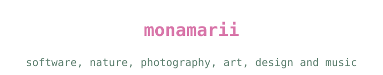
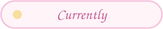
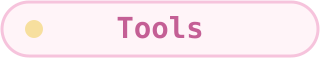

I am a software development student making small, curious things influenced by the natural world and the arts. I like projects that leave room for experimentation, atmosphere and play.

| Making | Learning | Inspired by |
| --- | --- | --- |
| Small software projects and creative experiments | Godot and interactive design | Nature, photography, music and handmade details |

| Area | What you will find |
| --- | --- |
| Code | Experiments, tools and software projects |
| Games | Interactive ideas and Godot projects |
| Visual work | Photography, design and image-making |

	<a href="https://github.com/monamarii?tab=repositories"><strong>Browse my repositories</strong></a>

  

<!--
**monamarii/monamarii** is a ✨ _special_ ✨ repository because its `README.md` (this file) appears on your GitHub profile.

Here are some ideas to get you started:

- 🔭 I’m currently working on ...
- 🌱 I’m currently learning ...
- 👯 I’m looking to collaborate on ...
- 🤔 I’m looking for help with ...
- 💬 Ask me about ...
- 📫 How to reach me: ...
- 😄 Pronouns: ...
- ⚡ Fun fact: ...
-->